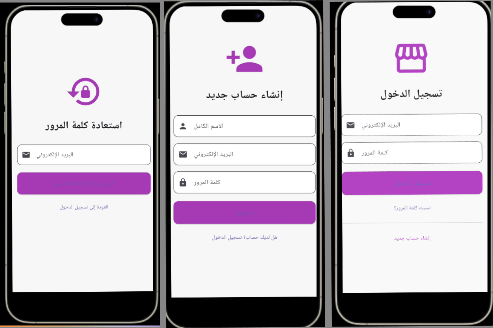

# 📱 مشروع تطبيق AppStore باستخدام Flutter

### 🧑‍🏫 تحت إشراف:

**م. بشار الحميدي**

### 👨‍🎓 إعداد الطالب:

**أسامة محمد سعيد البعداني**

---

## 📝 وصف المشروع:

يُعد تطبيق "AppStore" مشروعًا أكاديميًا تعليميًا يهدف إلى تدريب الطالب على إنشاء تطبيق متجر إلكتروني بسيط باستخدام Flutter. يقدم التطبيق مجموعة من الوظائف الأساسية مثل إنشاء حساب، تسجيل الدخول، واستعادة كلمة المرور، مع خطة واضحة لتطوير بقية الميزات تدريجيًا على مدى أسابيع محددة.

---

## 🎯 أهداف المشروع:

- اكتساب مهارات تطوير واجهات المستخدم التفاعلية باستخدام Flutter.
- التدريب على استخدام النماذج (Forms) والتحقق من صحة البيانات.
- تطبيق مفاهيم التنقل بين الصفحات وإدارة الحالة.
- التدرج في إنشاء تطبيق متكامل يبدأ من الواجهة وينتهي بالربط مع قاعدة البيانات.
- توثيق جميع مراحل المشروع بشكل واضح ومنهجي.

---

## ✨ مميزات المشروع:

- واجهات عربية مبسطة وسهلة الاستخدام.
- تنظيم احترافي لهيكل الملفات والمجلدات داخل المشروع.
- قابل للتوسعة لإضافة خصائص جديدة في المستقبل مثل: المنتجات، السلة، الطلبات، الدفع.
- مناسب للتدريب الأكاديمي ومراعي لمستوى الطلاب المبتدئين والمتوسطين.
- خطة تطوير واضحة وتوثيق متكامل لكل أسبوع من العمل.

---

## 🛠️ خطة العمل الأسبوعية:

### ✅ الأسبوع الأول: إنشاء الواجهات الأساسية

- تم إنشاء:
  - صفحة تسجيل الدخول
  - صفحة إنشاء حساب
  - صفحة استعادة كلمة المرور
- تنسيق واجهات احترافية باستخدام ألوان وتخطيط عصري.

#### 🖼️ لقطات شاشة:



<!-- 

 -->

---

### ✅ الأسبوع الثاني: توثيق المشروع

- تم إعداد ملف `README.md` وكتابة وصف المشروع بشكل أكاديمي منظم.
- توثيق الأهداف والمميزات والخطوات الأسبوعية.
- وتم عمل تكليف لي card
- سوف يتم التحسين عليه ودمجه ضمن المشروع

##### لقطه شاشه التكليف 2


---

### ⏳ الأسبوع الثالث: تصميم واجهة عرض المنتجات

- جاري العمل على تصميم صفحة تحتوي على قائمة/شبكة للمنتجات.

---

### 🔜 الأسبوع الرابع: تصميم سلة المشتريات وواجهة الطلبات

- سيتم إضافة واجهة لعرض المنتجات المختارة والكمية والإجمالي.

---

### 🔜 الأسبوع الخامس: ربط العمل مع قاعدة البيانات والواجهة الخلفية

- سيتم البدء بربط التطبيق بالخادم وقاعدة البيانات لاحقًا.

---

### 🔜 الأسبوع السادس: اختبار وتوثيق نهائي

- اختبار شامل لجميع الشاشات والوظائف.
- إعداد العرض النهائي والتوثيق الكامل.

---

## 🧪 البيئة المستخدمة:

- Flutter SDK
- Dart Language
- Android Emulator أو جهاز حقيقي للاختبار
- محرر VS Code أو Android Studio

---

## 📂 هيكل الملفات الحالي:

```
lib/
├── main.dart
└── screens/
    ├──  homwork.dart
    ├── login_screen.dart
    ├── register_screen.dart
    └── reset_password_screen.dart
assets/
└── screenshots/
    ├── login.png
    ├── register.png
    └── reset.png
```

---

## 📌 ملاحظات:

- هذا المشروع مخصص لأغراض تعليمية ضمن مقرر أكاديمي.
- التوثيق يتم تحديثه بشكل أسبوعي مع التقدم في العمل.
